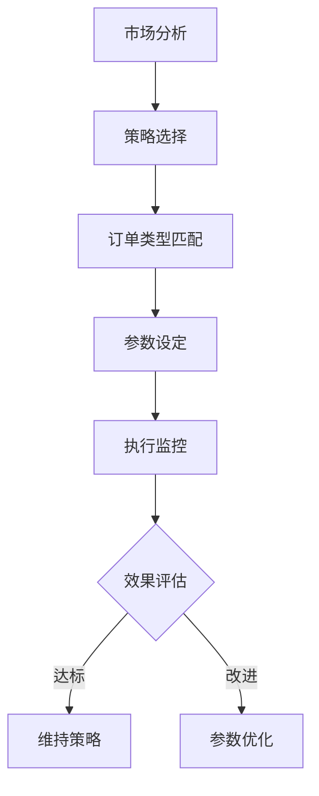

# 如何管理加密货币订单

## 理解不同订单类型

加密货币交易涉及多种订单类型，每种类型都有其独特功能与适用场景。掌握这些基础概念是高效管理订单的前提。

### 基础订单类型解析
| 订单类型        | 执行特点                          | 适用场景示例                  |
|-----------------|-----------------------------------|-----------------------------|
| 市价订单        | 即时按当前市价成交                | 追求快速成交，不计较具体价格 |
| 限价订单        | 设定指定价格区间执行              | 精准控制买入/卖出价位        |
| 止损订单        | 价格触发后转为市价单执行          | 防止亏损扩大/锁定利润        |
| 止损限价订单    | 双重价格条件控制                  | 平衡风险控制与执行确定性     |

### 进阶订单类型应用
- **条件订单**：通过预设价格或时间条件自动触发，适合设定复杂交易策略
- **冰山订单**：将大额订单拆分为小批量隐藏执行，降低市场冲击
- **一取消另一（OCO）**：组合设置两个互斥订单，实现多空双向风险管理

👉 [掌握专业订单管理技巧](https://bit.ly/okx_welcome)

## 高效下单策略

### 订单执行四步法
1. **市场分析**：结合K线图、交易量、市场情绪指标判断入场时机
2. **策略匹配**：根据日内交易/波段操作/长线投资选择对应订单类型
3. **参数设定**：精确计算支撑阻力位，设置合理的止盈止损点
4. **风险校验**：确保单笔风险不超过总资金的2-5%

### 优化订单执行的实用技巧
- **分批建仓**：将大额订单拆分为多个小单，降低价格滑点
- **时间窗口选择**：避开重大新闻发布时段，降低异常波动风险
- **流动性考量**：优先选择交易量前20的币种，确保订单可执行性

### 常见下单误区警示
- **过度杠杆**：新手建议使用1-3倍杠杆，避免强制平仓
- **盲目追涨杀跌**：市价单可能在剧烈波动中造成亏损
- **忽视手续费**：高频交易者应选择手续费低于0.1%的交易所

## 动态订单管理

### 实时监控体系搭建
- **价格警报**：通过交易所APP设置5级价格提醒（关键支撑/阻力位）
- **订单仪表盘**：使用OKX等平台的可视化工具追踪所有挂单状态
- **多设备同步**：PC端+移动端实时同步订单变动信息

### 修改/取消订单操作指南
1. **触发条件**：当市场出现重大基本面变化或技术形态突破时
2. **操作优先级**：先撤销失效订单，再重新评估入场点位
3. **历史记录管理**：定期导出订单修改日志进行回溯分析

### 特殊情况应对策略
- **闪崩行情**：启用自动止损系统防止流动性危机
- **网络延迟**：选择支持API交易的平台实现毫秒级响应
- **系统故障**：提前设置备用交易所账户作为应急通道

👉 [体验专业级订单管理系统](https://bit.ly/okx_welcome)

## 高级订单管理技巧

### 智能订单组合应用
- **金字塔建仓法**：价格每下跌10%增加0.5倍仓位的限价单
- **网格交易系统**：在支撑位挂买单，阻力位挂卖单的自动化策略
- **对冲订单配置**：同时设置BTC多单与ETH空单分散风险

### 算法交易进阶
- **时间加权平均价格（TWAP）**：将大单拆分为等时间间隔的小单
- **成交量加权平均价格（VWAP）**：根据实时成交量动态调整执行策略
- **冰山订单参数优化**：设置显示量不超过市场深度的15%

### 订单管理工具推荐
1. **交易所内置工具**：OKX的高级订单系统支持30+种条件单
2. **第三方管理平台**：3Commas、Cryptohopper实现多交易所管理
3. **API自动化**：通过Python脚本实现自定义订单逻辑

## 订单管理最佳实践

### 风险控制黄金法则
- **2%原则**：单笔交易风险不超过总资金的2%
- **5:1盈亏比**：确保潜在收益是风险的5倍以上
- **3倍波动区间**：止损位设置在3倍ATR指标之外

### 系统化交易框架

### 情绪管理技巧
- **交易日志记录**：每次修改订单需备注决策依据
- **压力测试演练**：模拟极端行情下的订单响应
- **强制冷却机制**：连续3笔亏损后暂停交易24小时

👉 [获取专业交易工具包](https://bit.ly/okx_welcome)

## 常见问题解答

### Q1：如何选择订单类型？
A：短线交易建议使用限价单+止损单组合，长线投资可采用冰山订单分批建仓。在剧烈波动行情中，市价单能确保快速成交。

### Q2：修改订单的最佳时机？
A：当市场出现重大新闻事件、价格突破关键技术位、或个人风险承受能力变化时应及时调整订单。

### Q3：如何降低订单滑点？
A：选择日交易量超10亿美元的主流币种，使用分批执行策略，避免在市场开盘/收盘高峰时段下单。

### Q4：订单有效期怎么设置？
A：日内交易建议设置GTD（指定日期前有效）为当日，波段操作可使用GTC（长期有效）但需定期检查。

### Q5：止损单会失效吗？
A：在极端跳空行情中可能无法完全执行，建议结合止损限价单+人工监控双重保障。

## 持续优化交易系统

### 订单数据分析框架
1. **执行成功率**：统计不同类型订单的成交率
2. **滑点分布**：分析不同时间段的价格偏差
3. **策略有效性**：回测不同订单组合的收益率
4. **费用结构**：优化交易频率与手续费的平衡

### 知识更新体系
- 每周研读CoinDesk、Cointelegraph行业报告
- 参加区块链开发者大会获取最新技术动态
- 关注CFTC等监管机构的政策更新

通过系统化的订单管理，交易者可以将市场波动转化为优势。建议新手从模拟交易开始，逐步建立个性化的订单管理系统。记住，成功的交易不是预测市场，而是通过科学的订单管理应对各种可能性。