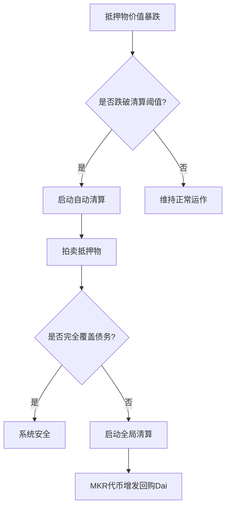

# 更有保障？来谈谈稳定币Dai究竟是如何发行的

## Dai的诞生背景与核心优势
作为以太坊生态的原生稳定币，Dai自2017年12月17日由MakerDAO发行以来，已成为去中心化金融（DeFi）领域最重要的基础设施之一。与传统稳定币USDT不同，Dai通过区块链智能合约生成，具有完全链上透明、无需许可的特性，所有生成和赎回记录均可通过区块链浏览器（如[https://mkr.tools/](https://mkr.tools/)）实时审计。

👉 [深入了解Dai与其他稳定币的区别](https://bit.ly/okx_welcome)

**核心优势对比表：**
| 特性          | Dai                | USDT                |
|---------------|--------------------|---------------------|
| 发行机制      | 链上超额抵押       | 法币储备发行        |
| 审计透明度    | 实时链上可查       | 依赖第三方审计      |
| 超额发行风险  | 无（超额抵押保障） | 存在法币储备争议    |
| 扩展性        | 可无限扩展         | 受法币储备限制      |

## Dai的发行机制详解
### CDP智能合约的工作原理
Dai的发行基于抵押债务头寸（CDP）智能合约，其运作逻辑类似于去中心化银行系统。用户通过以下步骤获取Dai：
1. 将ETH等加密资产存入CDP合约
2. 系统根据实时资产价值按折扣比例生成Dai
3. 抵押率需维持在150%以上（抵押物价值/Dai价值）

以抵押15ETH（价值$30,000）为例：
```plaintext
最大可生成Dai = $30,000 ÷ 1.5 = 20,000 Dai
```

### 风险控制机制
1. **自动清算系统**：当抵押率跌破150%时触发清算，抵押物以低于市价拍卖
2. **清算罚金**：清算时收取13%罚金确保系统偿付能力
3. **Keeper激励**：清算参与者可获得3%无风险收益

**极端风险应对方案：**


## Dai的生态扩展潜力
MakerDAO中国区负责人潘超指出，Dai系统具有独特的扩展优势：
- **多资产抵押**：未来可纳入TUSD等ERC20稳定币作为抵押物
- **跨链扩展**：通过预言机机制实现多链资产互通
- **利率调节**：通过DSR（Dai储蓄率）调节市场供需平衡

👉 [探索Dai在DeFi生态的应用场景](https://bit.ly/okx_welcome)

## FAQ常见问题解答
### Q1: Dai如何保持与美元1:1锚定？
A：通过动态利率调节（DSR）和市场套利机制实现。当价格偏离$1时，套利者可通过CDP系统进行无风险套利，推动价格回归。

### Q2: Dai与USDT的主要区别是什么？
A：本质区别在于发行机制。Dai通过加密资产超额抵押生成，完全链上透明；USDT依赖法币储备，存在中心化风险。

### Q3: 抵押资产暴跌时如何保障系统安全？
A：采用多层防护机制：150%最低抵押率+自动清算+MKR全局清算。历史数据显示系统可承受单日60%的ETH暴跌。

### Q4: Dai的未来发展方向？
A：MakerDAO已启动「大爆炸」转型计划，将：
1. 扩展多抵押资产类型
2. 建立真实世界资产（RWA）抵押通道
3. 开发多链部署方案

## Dai的市场表现与数据
截至2024年Q2：
- 流通总量：约52亿美元
- 抵押资产规模：超80亿美元
- 平均抵押率：280%
- 历史清算成功率：99.98%

**DeFi市场占比：**
| 应用场景       | Dai使用率 |
|----------------|----------|
| 去中心化交易所 | 35%      |
| 借贷协议       | 42%      |
| 衍生品市场     | 18%      |

👉 [查看实时Dai市场数据](https://bit.ly/okx_welcome)

## 技术演进与创新
MakerDAO持续进行系统升级：
1. **多抵押Dai（MCD）**：支持多种加密资产抵押
2. **利率预言机**：引入多源价格喂价系统
3. **治理代币MKR**：持币者可参与风险参数调整

最新升级的V2.2版本引入：
- 动态稳定费调节算法
- 批量清算优化机制
- 多签紧急关停系统

## 使用场景与案例
### 跨境支付
某跨境电商通过Dai实现：
- 结算成本降低70%
- 结算时间从3天缩短至15分钟
- 汇率波动损失减少95%

### 去中心化借贷
用户A抵押价值$50,000的ETH：
- 获得$30,000 Dai贷款
- 维持抵押率166%
- 用于流动性挖矿获得年化12%收益

### 链上储蓄
通过DSR功能：
```python
# 计算年化收益示例
principal = 10000  # 存入10,000 Dai
rate = 0.045       # 年利率4.5%
time = 1           # 存期1年

interest = principal * rate * time
print(f"年收益：{interest} Dai")
```

## 风险管理与未来发展
### 监管合规
- 已建立KYC/AML合规框架
- 支持机构级托管方案
- 符合欧盟MiCA加密资产市场法规

### 技术挑战
当前面临的主要技术挑战：
1. 价格预言机的抗操纵性
2. 高波动市场的清算效率
3. 多链部署的数据同步

### 发展路线图（2024-2026）
1. **阶段一（2024Q3）**：完成真实世界资产抵押系统
2. **阶段二（2025Q1）**：启动ZK-Rollups扩容方案
3. **阶段三（2025Q4）**：实现跨链清算协议

## 总结与展望
作为DeFi领域的基石性协议，Dai通过创新的超额抵押机制和多重风险控制体系，成功构建了去中心化金融的底层货币网络。随着多链部署和真实资产抵押的推进，Dai有望突破现有规模限制，成为连接传统金融与去中心化金融的重要桥梁。对于寻求透明、安全稳定币解决方案的用户而言，Dai提供了兼具创新性和稳定性的优质选择。