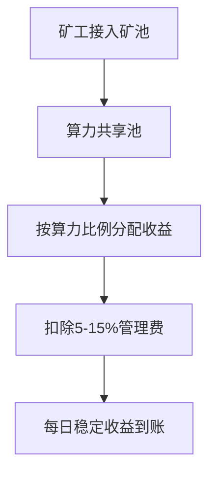

# 虚拟币的一级市场在哪里？

虚拟币市场存在一级市场与二级市场的明确划分。二级市场指代币安、欧易等主流交易平台，而一级市场作为新发行加密资产的流通源头，往往因参与门槛和操作复杂度让投资者产生困惑。本文将深度解析一级市场的核心参与路径，并提供风险规避指南。

## 一级市场的三大核心场景

虚拟币一级市场的运作机制与传统金融存在显著差异，主要通过以下三种方式进行价值创造：

### 1. 去中心化交易所（DEX）的创新实践  
作为区块链技术的原生应用，DEX平台通过智能合约实现点对点交易。用户需完成以下操作：  
- 连接MetaMask等加密钱包  
- 输入项目方提供的合约地址  
- 通过ETH等基础链资产完成认购  

👉 [探索去中心化交易解决方案](https://bit.ly/okx_welcome)  
**优势特征**：  
- 无中心化机构介入，交易透明度达100%  
- 早期参与价格通常低于二级市场30%-50%  
- 支持跨链资产互换功能  

**潜在限制**：  
- 新项目流动性深度不足  
- 需具备基础区块链知识  
- 存在合约漏洞风险  

### 2. 矿池挖矿的收益模型  
矿池通过算力聚合机制重构挖矿收益结构：  

**行业现状**：  
- 头部矿池（如Poolin）算力占比超行业30%  
- 2023年平均挖矿收益波动率较独立挖矿降低60%  

### 3. 矿机挖矿的硬核参与  
当前主流矿机性能参数对比：

| 矿机型号 | 算力(T/H) | 功耗(W) | 年化收益率* |
|---------|----------|--------|------------|
| Antminer S19 Pro | 110      | 3250   | 18-25%     |
| WhatsMiner M30S++ | 120     | 3400   | 20-28%     |
| AvalonMiner 1246 | 90       | 3100   | 15-22%     |

*注：基于2023年BTC价格及电费成本测算

## 一级市场风险防控指南

### 项目筛选黄金法则  
1. **技术验证三要素**：  
   - GitHub代码更新频率（月均≥15次为佳）  
   - 白皮书技术路线图与现实进展匹配度  
   - 安全审计机构资质（CertiK/SlowMist为优）  

2. **团队背调要点**：  
   - 核心成员LinkedIn履历真实性  
   - 项目方过往创业经历成功率  
   - 是否披露真实办公地址  

### 常见风险预警信号  
- 承诺固定年化收益超过50%  
- 项目方匿名且无社交媒体动态  
- 短期内完成超募但无明确资金使用计划  

## 常见问题解答（FAQ）

**Q1：如何判断新项目是否具备投资价值？**  
A：建议采用"3+2评估模型"：  
- 技术创新性（占40%权重）  
- 团队执行力（占30%权重）  
- 社区活跃度（占20%权重）  
- 资金储备（占10%权重）  

**Q2：矿池挖矿需要多少初始投入？**  
A：以当前市场行情，单台矿机投入约需：  
- 比特币挖矿：3-5万元  
- 以太坊挖矿：1.5-2.5万元  
- 联合挖矿方案可降低至5000元起  

**Q3：如何规避智能合约风险？**  
A：实施三重防护机制：  
1. 使用Etherscan等工具验证合约代码  
2. 检查合约是否通过形式化验证  
3. 设置交易滑点不超过0.5%  

## 投资策略优化建议

1. **仓位管理原则**：  
   - 单项目投资不超过总资金的5%  
   - 矿机挖矿与流动性挖矿比例建议3:7  

2. **动态监控体系**：  
   - 设置价格波动预警（波动率超过15%触发）  
   - 定期检查项目方钱包异动  
   - 跟踪CoinGecko等平台排名变化  

3. **退出机制设计**：  
   - 利润回撤20%强制减仓  
   - 项目进展滞后白皮书3个月以上清仓  

通过系统化的参与策略，投资者可以在控制风险的前提下把握一级市场溢价机会。建议新手从矿池挖矿开始实践，逐步过渡到复杂度更高的DEX项目投资，同时保持对行业监管动态的持续关注。