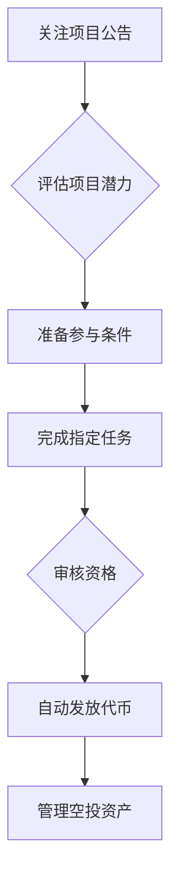

# Airdrop是什么？

## 1. Airdrop的定义

### Airdrop的核心概念
Airdrop（空投）是区块链领域中常见的用户激励机制，指项目方将加密货币或数字代币免费分发给特定用户群体的行为。这种分发方式通常用于新项目推广、社区建设或生态激励，用户可通过持有特定代币、参与社区活动等方式获得空投奖励。

### 历史起源与发展
该术语源自军事领域的"空投物资"概念，在区块链领域特指通过链上地址直接发放数字资产。比特币和以太坊生态的早期项目率先采用这种模式，2017年ICO热潮期间，Airdrop成为项目方快速获取用户的重要手段。随着DeFi和Web3.0的发展，空投形式持续进化，衍生出多种细分类型。

### 主要类型解析
| 类型            | 实施方式                     | 典型应用场景               |
|-----------------|----------------------------|--------------------------|
| 标准空投        | 持有特定代币的地址自动发放   | 新代币发行初期用户激励     |
| 任务奖励空投    | 完成社交任务后发放           | 项目社区推广               |
| 持仓奖励空投    | 特定时间点持仓用户获奖励     | 忠诚用户回馈               |
| 专属空投        | 针对特定社群成员发放         | 核心用户群体建设           |

👉 [立即了解区块链最新动态](https://bit.ly/okx_welcome)

## 2. Airdrop的行业价值

### 运作机制详解
完整的空投流程包含四个关键环节：
1. **项目公告**：通过官网、社交媒体等渠道发布空投计划
2. **资格筛选**：设定参与条件（如持币地址、社区互动等）
3. **智能合约执行**：通过链上代码自动完成代币分发
4. **用户接收**：符合条件的钱包地址自动到账空投代币

### 战略意义分析
- **生态扩张**：帮助项目快速积累活跃用户，如某DeFi平台通过空投实现3个月内用户量增长300%
- **社区激活**：激励用户参与治理投票，某DAO项目空投后社区提案参与度提升65%
- **市场教育**：降低用户参与门槛，某NFT项目空投后市场认知度提升40%

### 双面影响评估
**积极效应：**
- 创新项目冷启动加速器
- 普通投资者低成本参与创新
- 链上活跃度指标提升

**潜在风险：**
- 市场投机行为滋生
- 空投代币流动性压力
- 用户隐私数据暴露风险

## 3. 多维应用场景

### 营销推广创新
社交任务型空投已成为主流营销模式，典型案例包括：
- X项目要求关注Twitter并转发公告，实现单日粉丝增长5000+
- Y协议设计阶梯式任务，完成越多空投量越大，有效提升社区活跃度
- Z平台结合NFT铸造空投，创造新型用户增长飞轮

👉 [探索更多区块链应用场景](https://bit.ly/okx_welcome)

### 社区建设工具
成功项目案例显示：
- 某去中心化交易所通过持续空投，构建超10万活跃用户的社群
- 开发者通过空投激励社区成员参与代码审计，发现关键漏洞
- 创作者经济平台采用空投模式，使内容创作者收入提升3倍

### 项目冷启动策略
新兴项目实践表明：
- 某Layer2项目空投后，TVL（总锁定价值）首周突破5000万美元
- Web3社交平台通过空投实现用户留存率提升至85%
- 游戏公会采用空投机制，吸引全球200+社区节点参与

## 4. 参与指南与技巧

### 必备条件清单
1. **数字钱包**：推荐MetaMask、Trust Wallet等主流钱包
2. **链上身份**：需持有ETH、BTC等基础链资产
3. **社区账号**：Twitter、Telegram等社交平台账号
4. **KYC准备**：部分项目要求身份验证

### 参与流程图解

### 进阶技巧
- 建立多链钱包矩阵，覆盖主流生态
- 使用空投聚合器追踪最新机会
- 设置自动任务提醒避免错过窗口期
- 分散参与降低单一项目风险

## 5. 风险防控体系

### 诈骗识别指南
常见骗局特征：
- 要求支付"手续费"的空投
- 提供钓鱼网站链接
- 异常高额回报承诺
- 伪造项目方身份推广

### 安全防护措施
1. **技术防护**：启用2FA、硬件钱包存储
2. **信息验证**：通过官网、白皮书等官方渠道确认
3. **操作规范**：永不透露私钥，定期更换密码
4. **社区监测**：关注官方社群的公告更新

### 应急响应方案
遭遇诈骗时的处理流程：
1. 立即断开可疑链接
2. 冻结相关钱包资产
3. 向区块链安全机构报案
4. 在社区警示其他用户

## 常见问题解答

### 如何判断空投项目的可信度？
1. 核实项目方背景信息
2. 检查智能合约审计报告
3. 观察社区活跃度和反馈
4. 谨慎对待承诺高回报的项目

👉 [获取专业项目评估服务](https://bit.ly/okx_welcome)

### 空投收益需要缴税吗？
各国政策存在差异，建议：
1. 了解所在地的加密货币税收政策
2. 记录完整的交易记录
3. 咨询专业税务顾问
4. 合理规划资产配置

### 空投代币价格下跌怎么办？
可采取以下策略：
- 短期波动保持观察
- 长期持有优质项目
- 分批出售降低风险
- 转换为其他资产配置

### 如何最大化空投收益？
高效参与技巧：
- 建立多链参与能力
- 参与早期项目获取更高比例
- 组合参与不同类型空投
- 持续优化参与策略

### 空投会影响主网性能吗？
大规模空投可能造成：
- 网络拥堵
- Gas费用上涨
- 节点负载增加
建议选择非高峰时段参与，或选择低Gas消耗的二层网络项目。