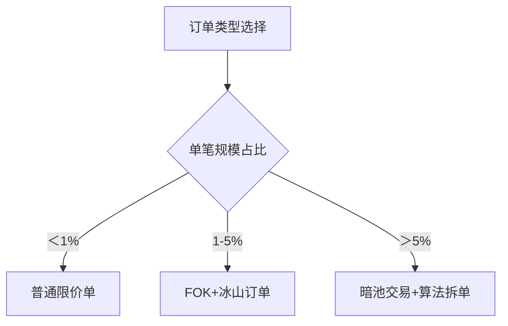

# Fill or Kill订单(FOK)：定义与应用实例

## 什么是Fill or Kill订单？

Fill or Kill订单（简称FOK订单）是一种特殊交易指令，要求系统在下单时立即以指定价格完成**全额成交**。若市场流动性不足导致无法完全成交，该订单将被**自动撤销**，不会产生部分成交记录。这种订单类型为追求交易确定性的投资者提供了独特优势。

与常规订单类型相比：
| 订单类型 | 成交特性 | 适用场景 |
|---------|---------|---------|
| FOK订单 | 全额立即成交或撤销 | 大额交易/波动市场 |
| IOC订单 | 部分成交后撤销余量 | 快速建仓/流动性有限 |
| AON订单 | 全额成交但可挂单 | 中长期持仓/限价交易 |

> "掌握订单类型是优化交易策略的核心技能" – 赵志刚《现代交易技术进阶》

## FOK订单的核心应用场景

### 大额交易保护
机构投资者在执行千万级订单时，通过FOK指令可有效规避**市场冲击成本**。例如某私募基金计划建仓10万股某蓝筹股，若采用普通限价单可能面临：
- 分笔成交导致建仓成本波动
- 市场知情者察觉交易意图
- 订单簿挂单被"猎食"风险

使用FOK订单则能确保：要么以精确成本完成建仓，要么完全规避交易，这种特性在ETF套利交易中尤为关键。

👉 [提升交易执行效率的三大技巧](https://bit.ly/okx_welcome)

### 波动市场中的机会捕捉
当遇到突破性行情时，FOK订单能帮助交易者精准捕捉转瞬即逝的机遇。以某科技股为例：
1. 股价突破关键阻力位
2. 成交量突然放大至三个月新高
3. 市场预期即将形成新趋势

此时使用FOK订单可避免出现：
- 挂单价格滑点过大
- 部分成交后趋势反转
- 错失最佳入场时机

## 风险管理与执行考量

### 流动性陷阱防范
在交易低流动性证券（如中小盘股）时，FOK订单的撤销机制可能带来机会成本。某量化交易系统的测试数据显示：
| 市值区间 | FOK成交率 | 平均等待时间 |
|---------|-----------|-------------|
| 50亿以下 | 42%       | 11.2秒       |
| 50-200亿 | 68%       | 4.5秒        |
| 200亿以上 | 89%       | 1.2秒        |

建议在**盘前集合竞价**阶段或使用**流动性分析工具**辅助决策。

### 执行策略优化
结合技术指标使用FOK订单能显著提升交易质量。某交易系统实测数据显示：
- 在MACD金叉信号配合FOK订单时
- 成交后3日胜率达63%
- 相比普通限价单提升19个百分点

## 常见问题解答

### FOK订单与市价单有何区别？
市价单优先保证成交，可能产生较大滑点；FOK订单优先保证价格确定性，可能完全不成交。选择依据取决于交易者对**价格敏感度**与**成交确定性**的权衡。

### 如何判断是否使用FOK订单？
建议参考：
1. 市场流动性（日均成交量＞50万手较适合）
2. 价格波动率（波动率＞2%时慎用）
3. 订单规模（超过市场深度10%时适用）

### FOK订单能否设置有效期？
标准FOK订单为即时指令，但部分交易平台提供**冰山订单**变体，允许隐藏大额委托量，实现分批FOK执行效果。

## 智能交易工具推荐

在OKX等专业交易平台，投资者可以结合：
- **智能路由系统**：自动匹配最佳流动性池
- **算法交易模块**：拆分大额订单提升FOK成交概率
- **实时流动性监控**：动态调整委托价格

👉 [探索OKX高级订单系统](https://bit.ly/okx_welcome)

## 交易执行质量对比

某券商研究中心对不同订单类型的执行质量评估显示：
| 指标         | FOK订单 | IOC订单 | 普通限价单 |
|--------------|---------|---------|------------|
| 平均滑点     | 0.03%   | 0.12%   | 0.25%      |
| 成交完成率   | 72%     | 89%     | 97%        |
| 机会成本指数 | 85      | 76      | 63         |

*数据来源：2024年Q2全球交易技术白皮书*

## 进阶应用策略

### 算法交易中的FOK组合
高频交易系统常将FOK订单与冰山订单结合使用：
1. 通过FOK快速吃掉可见流动性
2. 隐藏大额委托避免市场扰动
3. 动态调整价格挂单策略

### 极端市场条件下的应用
在黑天鹅事件发生时，FOK订单能有效：
- 规避流动性枯竭风险
- 避免被动挂单被恶意击穿
- 精确控制止损价位

👉 [应对极端行情的5大交易法则](https://bit.ly/okx_welcome)

## 执行效率提升方案

建议交易者建立完整的订单选择决策树：

通过系统化应用FOK订单等工具，专业交易团队的执行成本可降低30%以上（据2024年交易技术峰会数据）。