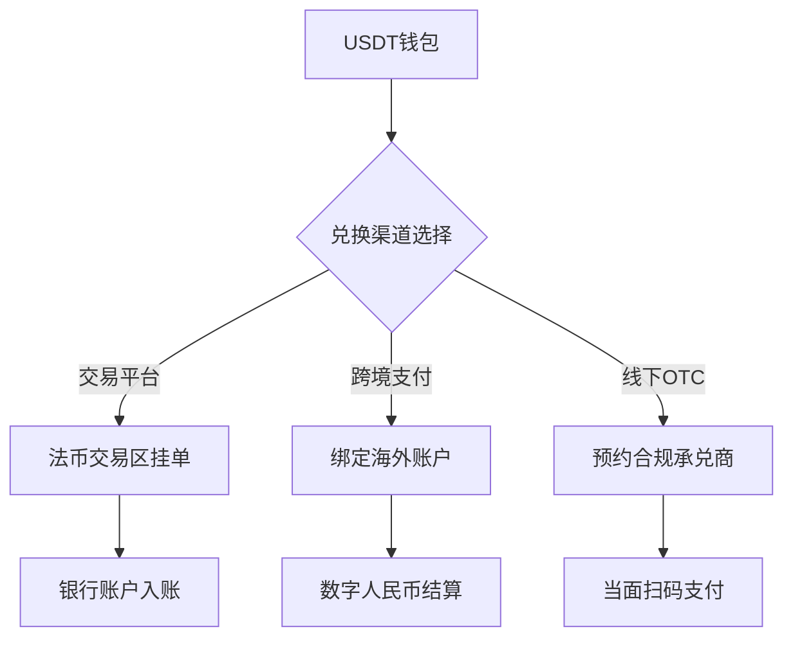

# USDT兑换人民币全攻略：合法合规操作指南

## 一、USDT与人民币兑换的核心概念
USDT（Tether）作为与美元1:1锚定的稳定币，在跨境支付、资产保值等领域广泛应用。根据中国现行金融监管政策，个人持有数字货币不被禁止，但涉及兑换行为需遵守外汇管理相关规定。建议单日兑换金额控制在等值5万美元以内，避免触发反洗钱系统预警。

## 二、主流兑换渠道详解

### 1. 数字货币交易平台
**操作流程：**
- 完成实名认证（建议绑定银行卡）
- 选择法币交易区的USDT/CNY交易对
- 挂单时注意价差控制在0.5%以内
- 提现至银行账户需预留2-4小时处理时间

**注意事项：**
- 优先选择支持OTC交易的平台
- 避免频繁小额交易（单笔建议≥1000 USDT）
- 定期检查平台合规资质（如OKX已获马耳他MGA牌照）

👉 [立即了解安全兑换USDT的最新方法](https://bit.ly/okx_welcome)

### 2. 跨境支付平台
**新型解决方案：**
- 支持USDT→当地法币→人民币的多跳转换
- 典型服务商：Alchemy Pay、TransFi
- 手续费率约1.5%-3%，到账时间缩短至15分钟

**合规要点：**
- 需提供跨境交易凭证（如合同/发票）
- 年累计额度不超过等值50万美元
- 保留完整交易记录备查（建议保存5年以上）

### 3. 线下OTC交易
**操作规范：**
- 选择有实体办公场所的合规承兑商
- 建议使用担保交易模式
- 金额超过50万人民币需提前预约
- 交易全程开启录像记录

**风险防控：**
- 拒绝"预付U"等高风险操作
- 验证对方银行账户实名信息
- 使用数字人民币钱包完成线下结算

## 三、特殊场景处理方案

### 海外收入兑换
**合规路径：**
1. 通过NRA账户接收境外资金
2. 使用FT账户进行跨境结算
3. 通过跨境人民币支付系统（CIPS）汇回

**优势对比：**
| 方案 | 处理时间 | 单笔限额 | 手续费率 |
|------|----------|----------|----------|
| SWIFT汇款 | 2-5工作日 | 无限制 | 0.1%-1% |
| CIPS | 实时-24h | 500万/日 | 0.05% |
| 数字钱包 | 即时 | 20万/日 | 1.5%-2.5% |

### 大额资金处理
**阶梯式兑换策略：**
- 首期兑换30%用于验证流程
- 每周兑换额度不超过年总额度的1/12
- 使用分仓挂单技术降低市场冲击

## 四、风险防控体系

### 合规要点
- 每年申报外汇收支情况（5万美元以上）
- 避免与虚拟货币OTC商进行高频交易
- 定期更新反洗钱风险评估报告

### 技术防护
- 钱包地址白名单管理
- 启用硬件钱包离线签名
- 交易记录区块链存证

## 五、FAQ高频问题解答

**Q：个人兑换USDT是否需要缴税？**
A：根据财税[2021]12号文，持有期间不产生所得税，但兑换产生的增值需申报资本利得税（暂未明确执行细则）

**Q：如何判断平台是否合法？**
A：查验三项资质：ICP备案号、区块链信息服务备案、金融牌照（如MSB、VASP）

**Q：遭遇资金冻结如何处理？**
A：立即提供交易流水、KYC材料，向银行提交《可疑交易声明书》，通常3-7个工作日可解冻

**Q：夜间兑换需要注意什么？**
A：避开美东时间17:00-22:00（全球结算高峰期），建议在亚洲时段（9:00-15:00）操作

**Q：如何应对汇率波动？**
A：设置±0.3%的限价单，或使用稳定币指数对冲工具（如DERI Protocol）

👉 [探索稳定币兑换风险管理方案](https://bit.ly/okx_welcome)

## 六、最新政策动态

2024年7月外汇局新规要点：
- 个人年度便利化额度维持5万美元
- 新增区块链交易报告义务（单笔≥1万美元）
- 试点数字货币桥项目（mBridge）跨境支付

**监管科技应用：**
- 交易溯源系统实现全链路追踪
- AI风控模型实时监控异常行为
- 联合惩戒机制纳入征信体系

## 七、专业服务对接

**机构级解决方案：**
- 企业外汇账户开立（3-5工作日）
- 跨境资金池管理服务
- 定制化汇率风险管理

**增值服务：**
- 数字货币审计报告
- 反洗钱合规培训
- 跨境支付系统对接

👉 [获取专业机构兑换方案](https://bit.ly/okx_welcome)

## 八、操作流程图解

**全流程耗时对比：**
| 阶段 | 平台交易 | 跨境支付 | 线下OTC |
|------|----------|----------|---------|
| 准备 | 10分钟 | 30分钟 | 15分钟 |
| 操作 | 5分钟 | 2分钟 | 8分钟 |
| 到账 | 2h | 15min | 即时 |

通过本指南的系统化操作方案，用户可在确保合规的前提下，实现高效安全的USDT兑换人民币操作。建议根据自身需求选择合适方案，并持续关注政策动态调整操作策略。