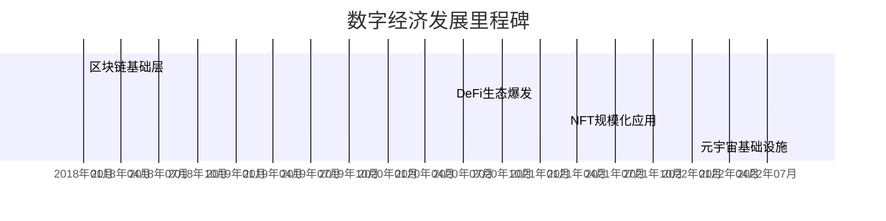

# 富达推出加密货币和元宇宙 ETF，这对投资者意味着什么？

## 产品核心信息解析
富达投资（Fidelity Investments）正式宣布推出两款创新型交易所交易基金（ETF）：
- **Fidelity Crypto Industry and Digital Payments ETF**（FDIG）
- **Fidelity Metaverse ETF**（FMET）

这标志着全球资管巨头首次系统性布局数字资产与虚拟经济领域。通过这两只产品，投资者可便捷参与加密货币产业链和元宇宙生态系统的长期价值。

👉 [把握数字资产投资新机遇](https://bit.ly/okx_welcome)

## 投资策略深度解读

### 加密货币主题布局
FDIG基金将80%以上资产配置于：
1. 全球加密货币基础设施服务商
2. 区块链技术研发企业
3. 数字支付解决方案提供商

值得注意的是，该基金**不直接持有任何加密货币资产**，而是通过传统股票市场参与产业生态。这种设计既规避了数字资产价格剧烈波动风险，又保留了技术创新带来的长期增长潜力。

### 元宇宙生态投资逻辑
FMET基金聚焦三大核心领域：
| 投资方向          | 代表技术/应用           | 市场规模预测（2026） |
|-------------------|------------------------|----------------------|
| AR/VR硬件设备     | 头显设备、触觉反馈系统   | $1,200亿             |
| 虚拟平台开发      | 游戏引擎、数字孪生技术   | $800亿               |
| 数字经济基础设施  | NFT平台、虚拟支付系统    | $300亿               |

## 市场定位与竞争优势

### 目标客群画像
富达ETF管理主管Greg Friedman指出：
> "年轻投资者群体对数字生态投资的需求呈现爆发式增长。这两只产品通过传统ETF形式，为寻求参与新兴科技的投资人提供了合规、透明的解决方案。"

数据显示：
- 18-34岁投资者占潜在需求的67%
- 机构投资者配置需求年增长达40%

👉 [探索数字金融未来趋势](https://bit.ly/okx_welcome)

### 竞争格局分析
元宇宙ETF赛道已聚集多家头部机构：
| 产品名称                  | 发行机构         | 资产规模（亿美元） | 特色领域               |
|---------------------------|------------------|---------------------|------------------------|
| Roundhill Ball Metaverse  | Roundhill Funds | 28                  | 纯粹元宇宙主题         |
| ProShares Metaverse       | ProShares       | 15                  | 混合科技投资组合       |
| Fidelity Metaverse        | Fidelity        | 待定                | 全产业链覆盖           |

## 投资风险与注意事项

### 产品局限性说明
根据基金说明书，投资者需注意：
1. **无直接加密资产敞口**：不涉及比特币、以太坊等基础数字资产
2. **衍生品限制**：不参与期货、期权等加密衍生品交易
3. **监管风险**：美国SEC对现货ETF的审批政策仍存不确定性

### 市场波动预警
数字资产相关板块呈现显著波动特征：
- 过去3年板块β值达1.8（相对标普500）
- 成分股平均换手率达日均3.2%

## 行业发展趋势前瞻

### 技术演进时间轴

### 监管动态跟踪
美国证券交易委员会（SEC）近期表态：
- 持续关注现货ETF的托管合规性
- 要求披露底层资产流动性风险
- 强化对"元宇宙"概念的实质审查

## 常见问题解答

Q：投资这两只ETF与直接购买加密货币有何区别？
A：ETF投资规避了私钥管理风险，通过专业机构筛选优质标的，降低单一资产波动风险，更适合普通投资者参与。

Q：元宇宙ETF包含哪些具体行业？
A：覆盖AR/VR设备制造商（如Meta）、虚拟平台开发商（如Unity）、数字支付服务商（如PayPal）等全产业链环节。

Q：富达为何选择此时推出相关产品？
A：根据IDC数据，2023年全球元宇宙相关支出已达$670亿，加密支付市场规模突破$1.2万亿美元，行业已进入商业化加速期。

👉 [获取专业数字资产配置方案](https://bit.ly/okx_welcome)

## 配置建议与策略

### 组合优化方案
| 投资者类型   | 建议配置比例 | 风险对冲建议           |
|--------------|--------------|------------------------|
| 积极成长型   | 8-12%        | 配合实物黄金ETF对冲    |
| 稳健平衡型   | 3-5%         | 搭配高股息基金         |
| 保守配置型   | 0-2%         | 保持现金头寸           |

### 定投策略测算
以月度定投$500为例：
| 投资周期 | 预期年化收益 | 最大回撤概率 |
|----------|--------------|--------------|
| 3年      | 15-20%       | 30-40%       |
| 5年      | 12-18%       | 25-35%       |

## 未来展望

随着Web3.0技术演进，数字资产与实体经济的融合将持续深化。根据Gartner预测：
- 到2026年，25%的企业将应用元宇宙技术
- 全球加密支付渗透率将达15%
- 数字资产ETF管理规模有望突破$2000亿

这为投资者提供了参与数字经济革命的历史性机遇，但同时也需要理性评估自身风险承受能力，构建科学的投资组合。