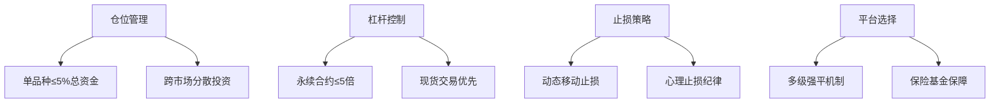

# 虚拟币爆仓是什么意思？

在虚拟货币交易领域，"爆仓"是投资者必须警惕的核心风险之一。这个看似专业的术语，实则关系着每个参与者的资金安全。本文将从基础概念到实战策略，系统解析虚拟币爆仓的形成机制与防范之道。

---

## 爆仓的本质解析

在加密货币交易中，**爆仓**特指投资者因账户保证金不足，无法维持开仓时的保证金要求，最终被交易平台强制平仓的情形。这种现象在使用杠杆交易时尤为常见，当市场价格朝不利方向波动，账户权益跌破维持保证金水平时，系统将自动执行强制平仓操作。

👉 [如何选择安全的虚拟货币交易平台？](https://bit.ly/okx_welcome)

与传统金融市场相比，加密货币市场特有的高波动性使爆仓风险呈指数级放大。特别是在极端行情下，价格剧烈波动往往导致大规模强制平仓，形成"多杀多"的恶性循环。据CoinGlass数据显示，2023年仅比特币单品种就发生过单日超40亿美元的爆仓事件。

---

## 爆仓形成机制深度剖析

### 核心诱因分析

| 风险因子       | 影响程度 | 典型案例                     |
|----------------|----------|------------------------------|
| 杠杆倍数       | ★★★★★   | 100倍杠杆交易亏损超99%本金    |
| 市场波动率     | ★★★★★   | 熊市初期24小时超30%跌幅      |
| 保证金比例     | ★★★★☆   | 5%保证金账户抗风险能力薄弱    |
| 流动性水平     | ★★★★☆   | 小市值代币暴跌时难以及时平仓  |

### 风险传导路径

1. **杠杆放大效应**：假设投资者用1 BTC本金+9 BTC杠杆做多，当价格下跌10%时，实际亏损已达本金的100%
2. **保证金预警机制**：当账户权益跌破维持保证金阈值（通常为5%-10%），触发强平预警
3. **流动性冲击**：市场深度不足时，市价单可能造成滑点损失，加速爆仓进程

---

## 风险控制实战指南

### 四维防御体系



### 关键策略详解

1. **动态杠杆调整**：根据市场波动率（ATR指标）调整杠杆倍数，在震荡市采用3-5倍，趋势市降至1-2倍
2. **保证金优化公式**：  
   ```
   安全保证金比例 = (最大历史回撤率 × 1.5) + 5%
   ```
   当BTC季度合约最大回撤为25%时，建议保证金不低于42.5%

3. **跨市场对冲**：在现货、期权、永续合约间建立对冲组合，使用ETH/BTC套利对冲市场风险

👉 [全球Top3加密货币交易所深度评测](https://bit.ly/okx_welcome)

---

## 爆仓预警指标体系

| 指标名称       | 警戒阈值 | 监测工具         |
|----------------|----------|------------------|
| 资金费率       | >0.1%/8小时 | TradingView      |
| 未平仓量       | 周增幅>30% | Coinglass        |
| 多空比         | >1.5:1    | Bybt             |
| 波动率指数     | IV>50%    | Deribit          |

当BTC永续合约资金费率连续3日高于0.15%，且多空比突破2:1时，系统性爆仓风险将显著上升。此时应主动降低仓位至30%以下，并将止损幅度收窄至当前ATR值的1.2倍。

---

## 常见问题解答

**Q：如何判断是否处于强平风险区？**  
A：通过计算强平价格与现价的偏离度，当差值小于当前波动率1倍标准差时，需立即减仓

**Q：爆仓后能否追回损失？**  
A：强制平仓为不可逆操作，但部分平台提供保险基金补偿机制，OKX等头部交易所会用10%-30%的保险金抵扣穿仓损失

**Q：新手如何安全使用杠杆？**  
A：建议从现货定投开始，待收益率波动率（Sharpe Ratio）稳定大于1后，再尝试≤3倍杠杆交易

**Q：市场闪崩时如何自救？**  
A：立即启动流动性管理预案：1. 关闭所有限价单释放冻结资金 2. 优先平仓高杠杆合约 3. 将保证金比例提升至20%以上

---

## 行业最佳实践

头部交易机构普遍采用"三级防御体系"：
1. **技术层**：部署智能止损系统，设置动态追踪止损（Trailing Stop）
2. **策略层**：构建多空平衡组合，保持30%-50%的对冲头寸
3. **执行层**：设置API自动减仓程序，当保证金率跌破预警线时自动平仓10%-30%

👉 [获取专业级风险管理工具包](https://bit.ly/okx_welcome)

---

通过建立科学的风险管理体系，投资者可以将爆仓概率降低80%以上。记住：在加密货币市场生存的关键不在于单笔收益多高，而在于能否长期避免强制平仓。建议每日开盘前检查保证金率、调整止损位，并保持至少30%的现金储备以应对极端行情。